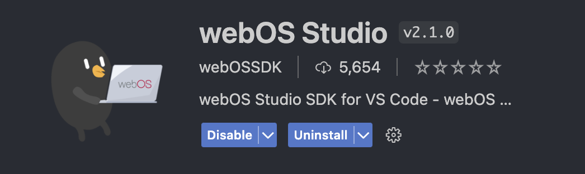
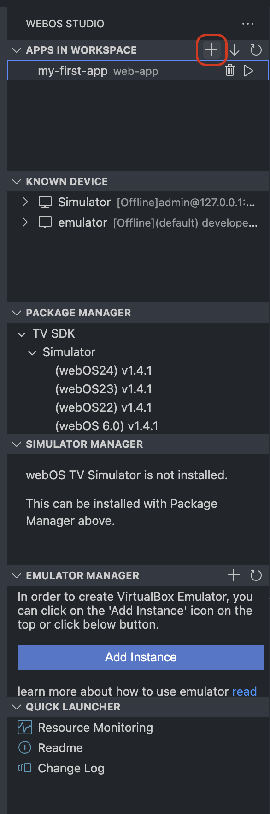
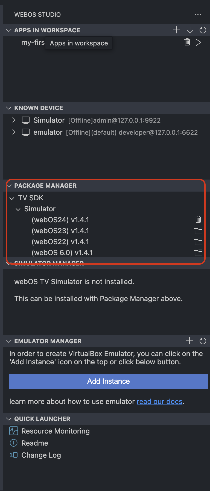
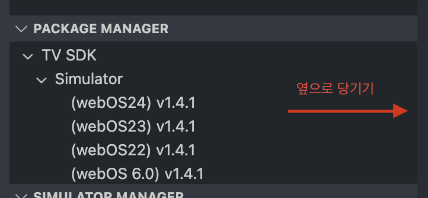
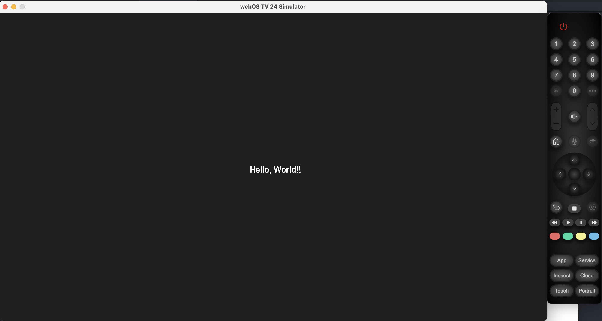

## webOS 앱 만들기

### 공식 가이드 링크

- [가이드 링크](https://webostv.developer.lge.com/develop/tools/webos-studio-dev-guide#package-install-and-launch-the-app)

### 환경설정

1. webOS Studio 플러그인 설치

2. 새 프로젝트 스캐폴딩

3. 시뮬레이터 설정

- webOS Studio 플러그인을 설치하면 **Package Manager** SDK를 저장할 경로를 지정하라는 프롬프트가 뜬다. (만약 무시했다면 webOS Studio 플러그인의 상태를 enabled - disabled를 토글한다.)

- 경로를 지정하면 시뮬레이터를 설치할 수 있다.

- 만약 시뮬레이터 설치 버튼이 보이지 않는다면 사이드바에 가려져 있을 수 있다.

---

#### 주의

- [Simulator Installation](https://webostv.developer.lge.com/develop/tools/simulator-installation) 페이지에서 시뮬레이터를 설치하면 webOS Studio에서 인식하지 못한다.

- 위의 webOS Studio의 package manager를 사용해 설치하자.

### 결과

### 그 외

- ares(webOS CLI) 또는 webOS Studio를 사용할 수 있다.
- webOS Studio를 사용하는 편이 더 낫다. (대신 이 경우 ares는 삭제해야 한다.)
